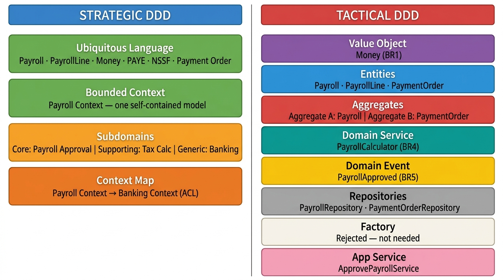
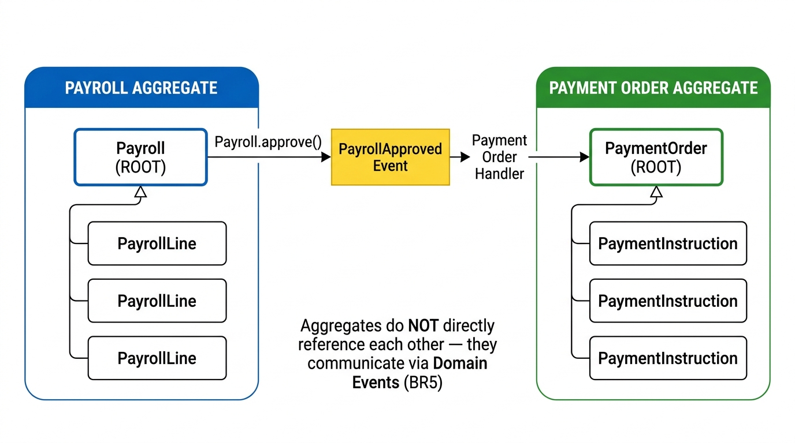
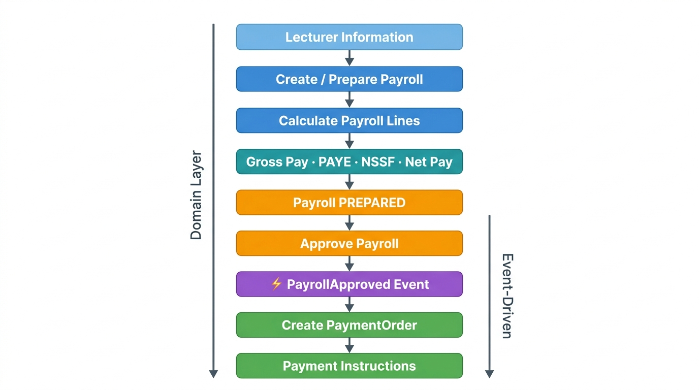
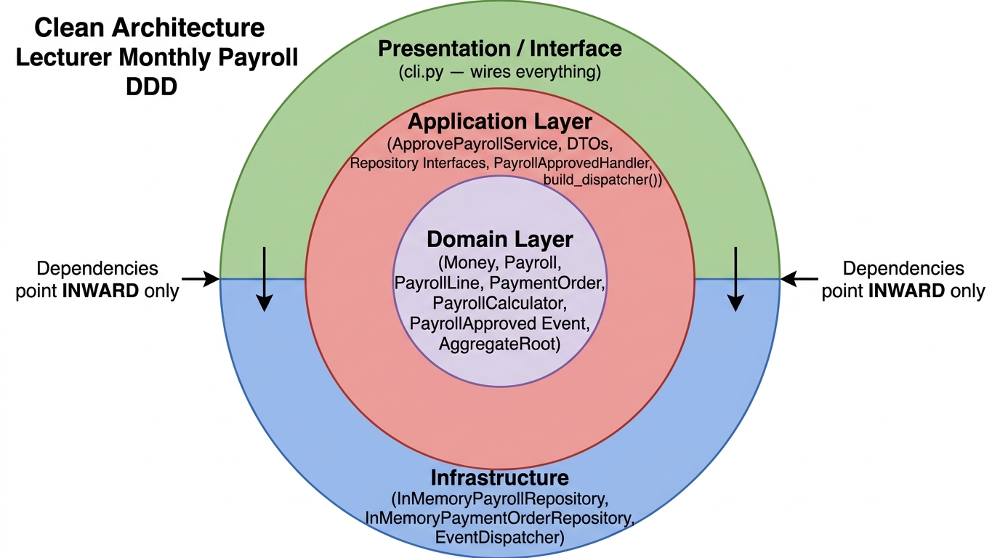

# Lecturer Payroll System — Domain-Driven Design Documentation

**Reference:** Eric Evans – *Domain-Driven Design* (2003) · Vaughn Vernon – *Implementing Domain-Driven Design* (2013)

---

## Table of Contents

1. [Document Purpose](#1-document-purpose)
2. [System Overview](#2-system-overview)
3. [Domain Description](#3-domain-description)
4. [Business Rules](#4-business-rules)
5. [Ubiquitous Language](#5-ubiquitous-language)
6. [Bounded Context](#6-bounded-context)
7. [Subdomain Analysis](#7-subdomain-analysis)
8. [Context Map](#8-context-map)
9. [Domain Model](#9-domain-model)
10. [Value Object — Money](#10-value-object--money)
11. [Entities](#11-entities)
12. [Aggregates](#12-aggregates)
13. [Aggregate Communication](#13-aggregate-communication)
14. [Domain Service — PayrollCalculator](#14-domain-service--payrollcalculator)
15. [Domain Event — PayrollApproved](#15-domain-event--payrollapproved)
16. [Application Service — ApprovePayrollService](#16-application-service--approvepayrollservice)
17. [Repositories](#17-repositories)
18. [Factory Decision](#18-factory-decision)
19. [End-to-End Payroll Workflow](#19-end-to-end-payroll-workflow)
20. [Layered / Clean Architecture](#20-layered--clean-architecture)
21. [Layer Responsibilities](#21-layer-responsibilities)
22. [Design Decisions](#22-design-decisions)
23. [Strategic vs Tactical DDD](#23-strategic-vs-tactical-ddd)
24. [DDD Pattern Summary](#24-ddd-pattern-summary)
25. [Component Relationships](#25-component-relationships)
26. [Conclusion](#26-conclusion)

---

## 1. Document Purpose

This document describes the design of the Lecturer Payroll System using Domain-Driven Design (DDD) principles and a layered/clean architecture approach.

The purpose is to document the actual system — its business rules, domain model, processing flow, aggregates, services, events, repositories, and architectural decisions.

DDD concepts from Eric Evans and Vaughn Vernon are used as **design foundations** rather than as the structure of the document.

---

## 2. System Overview

### 2.1 System Purpose

The Lecturer Payroll System manages the preparation, calculation, approval, and payment processing of monthly lecturer salaries.

The system is responsible for:

- Preparing monthly payrolls
- Managing lecturer payroll lines
- Calculating gross pay, PAYE, NSSF, and net pay
- Approving payrolls
- Generating payment orders and payment instructions for approved payrolls

> Actual bank transfer execution is **outside** the system boundary.

### 2.2 System Boundary

```
                     Lecturer Payroll System
┌─────────────────────────────────────────────────────────┐
│                                                         │
│  Payroll Preparation                                    │
│          │                                              │
│          ▼                                              │
│  Salary Calculation                                     │
│          │                                              │
│          ▼                                              │
│  Payroll Approval                                       │
│          │                                              │
│          ▼                                              │
│  Payment Order Generation                               │
│                                                         │
└─────────────────────────────────────────────────────────┘
             │                              │
             ▼                              ▼
        HR Context                    Banking Context
        (External)                    (External)
```

| | Items |
|---|---|
| **Inside the system** | Payroll, PayrollLine, Money, PayrollCalculator, PaymentOrder, PaymentInstruction, PayrollApproved, repositories, application services |
| **Outside the system** | Actual bank transfer execution, external banking infrastructure, external HR master-data management |

---

## 3. Domain Description

**Domain:** Lecturer payroll management.

**Central business problem:**

> Calculate the correct amount owed to each lecturer and ensure that an approved payroll produces the appropriate payment instructions.

The system therefore focuses on salary calculation, statutory deductions, payroll approval, and payment-order generation.

---

## 4. Business Rules

The following business rules drive the domain model. They are implemented inside the appropriate domain objects — not in controllers or infrastructure code.

| ID | Business Rule |
|---|---|
| **BR1** | Money must be represented as a whole, non-negative UGX amount. |
| **BR2** | A payroll can only be approved when its approval conditions are satisfied. |
| **BR3** | A payment order can only be created from an approved payroll. |
| **BR4** | Payroll calculation produces gross pay, PAYE, NSSF, and net pay. |
| **BR5** | Separate aggregates communicate through domain events rather than directly modifying one another. |
| **BR6** | A payroll must exist before it can be approved. |

---

## 5. Ubiquitous Language

The system uses a common vocabulary shared by the domain model, developers, and domain stakeholders. These terms are reflected directly in the domain model and code.

| Term | Meaning |
|---|---|
| **Payroll** | The monthly collection of lecturer payroll information. |
| **Payroll Line** | One lecturer's salary information within a payroll. |
| **Basic Salary** | The lecturer's base salary before additions and deductions. |
| **Allowance** | An additional payment included in salary calculation. |
| **Gross Pay** | Pay before statutory deductions. |
| **PAYE** | Income-tax deduction. |
| **NSSF** | Statutory social-security deduction. |
| **Net Pay** | Amount remaining after deductions. |
| **Payment Order** | An instruction representing payments generated from an approved payroll. |
| **Payment Instruction** | An individual payment instruction within a payment order. |
| **Payroll Approval** | The domain operation that changes a prepared payroll into an approved payroll. |

---

## 6. Bounded Context

### 6.1 Payroll Context

The system is modeled as a single **Payroll Bounded Context**.

Within this boundary, terms such as Payroll, PayrollLine, Gross Pay, PAYE, NSSF, Net Pay, and PaymentOrder have exactly the meanings defined in the Ubiquitous Language above.

The Payroll Context does not attempt to model the complete banking or human-resources domains.

```
┌─────────────────────────────────────┐
│          PAYROLL CONTEXT            │
│                                     │
│  Payroll                            │
│  PayrollLine                        │
│  Money                              │
│  PayrollCalculator                  │
│  PaymentOrder                       │
│  PaymentInstruction                 │
│  PayrollApproved                    │
│                                     │
└───────────────┬─────────────────────┘
                │ Integration
                ▼
       ┌───────────────────┐
       │  Banking Context  │
       │    (External)     │
       └───────────────────┘
```

---

## 7. Subdomain Analysis



> The classification below is a design analysis of this specific system and should not be treated as a universal classification for every payroll organisation.

| Capability | Classification | Reason |
|---|---|---|
| **Payroll Management and Approval** | **Core Domain** | Contains the main business workflow and payroll-specific rules. |
| **Payroll Calculation and Statutory Deductions** | **Supporting Subdomain** | Important to payroll processing but based on defined statutory rules. |
| **Banking Transfer Execution** | **Generic / External Capability** | Actual transfer is supplied by banking infrastructure, not payroll business logic. |

---

## 8. Context Map

The Payroll Context interacts with external contexts. The Payroll Context owns all payroll business rules. External contexts are not allowed to redefine the meaning of payroll concepts inside the Payroll Context boundary.

```
┌──────────────────────┐
│      HR Context      │
│      (External)      │
└──────────┬───────────┘
           │ Lecturer information
           ▼
┌──────────────────────┐
│    Payroll Context   │
│                      │
│  Payroll             │
│  Calculation         │
│  Approval            │
│  Payment Orders      │
└──────────┬───────────┘
           │ Payment information
           ▼
┌──────────────────────┐
│   Banking Context    │
│      (External)      │
└──────────────────────┘
```

---

## 9. Domain Model

The core domain objects and their DDD roles:

| Object | DDD Role | Main Responsibility |
|---|---|---|
| `Payroll` | Entity / Aggregate Root | Controls payroll identity, state, and approval. |
| `PayrollLine` | Entity within Payroll Aggregate | Represents one lecturer's payroll information. |
| `Money` | Value Object | Represents valid monetary values. |
| `PayrollCalculator` | Domain Service | Performs payroll calculations. |
| `PaymentOrder` | Entity / Aggregate Root | Represents payment processing for an approved payroll. |
| `PaymentInstruction` | Child Entity | Represents an individual payment instruction. |
| `PayrollApproved` | Domain Event | Announces successful payroll approval. |

```
                    DOMAIN
                       │
        ┌──────────────┼──────────────┐
        │              │              │
      Payroll         Money       PayrollCalculator
        │
        │ contains
        ▼
   PayrollLine


     PaymentOrder
          │
          ▼
   PaymentInstruction
```

---

## 10. Value Object — Money

`Money` represents an amount of money without having an independent identity.

**Responsibilities:**
- Validate that the amount is non-negative
- Represent monetary values in UGX
- Compare monetary values by value
- Prevent invalid monetary states

> `Money(5000 UGX)` and another `Money(5000 UGX)` represent the same value.  
> The object does not need a unique identity such as `money_id`.

**Design Properties:**

| Property | Applied |
|---|---|
| Immutable | ✅ |
| No independent identity | ✅ |
| Compared by value | ✅ |
| Validates its own state | ✅ |

---

## 11. Entities

### 11.1 Payroll

`Payroll` is an aggregate root with a unique `payroll_id` and a defined lifecycle.

```
PREPARED
    │
    │ approve()
    ▼
APPROVED
```

**Responsibilities:**
- Maintaining payroll identity
- Managing payroll lines
- Controlling approval
- Enforcing payroll approval rules
- Raising `PayrollApproved`

### 11.2 PayrollLine

A `PayrollLine` represents one lecturer's salary information within a payroll.

| Field | Description |
|---|---|
| `lecturer_id` | Identifies the lecturer |
| `basic_salary` | Base salary (Money) |
| `allowances` | Additional payments (Money) |
| `unpaid_leave` | Leave deduction input |
| `gross_pay` | Computed by PayrollCalculator |
| `paye` | Computed statutory deduction |
| `nssf` | Computed statutory deduction |
| `net_pay` | Final take-home amount |

> A payroll line belongs to its Payroll aggregate and is **not independently persisted** through its own repository.

### 11.3 PaymentOrder

`PaymentOrder` is the second aggregate root. It represents the payment instructions generated from an approved payroll.

```
CREATED
```

> A payment order must not be created from an unapproved payroll (BR3).

---

## 12. Aggregates



### 12.1 Payroll Aggregate

```
┌──────────────────────────────┐
│       PAYROLL AGGREGATE      │
│                              │
│       Payroll  (ROOT)        │
│          │                   │
│          ├── PayrollLine     │
│          ├── PayrollLine     │
│          └── PayrollLine     │
│                              │
└──────────────────────────────┘
```

`Payroll` is the single entry point for all changes to the payroll aggregate.

### 12.2 Payment Order Aggregate

```
┌──────────────────────────────┐
│   PAYMENT ORDER AGGREGATE    │
│                              │
│     PaymentOrder  (ROOT)     │
│          │                   │
│          ├── Instruction     │
│          ├── Instruction     │
│          └── Instruction     │
│                              │
└──────────────────────────────┘
```

`PaymentOrder` controls all of its payment instructions.

---

## 13. Aggregate Communication

The aggregates do **not** directly modify each other. They communicate through a domain event.

```
Payroll
   │
   │ approve()
   ▼
PayrollApproved event
   │
   │ dispatch
   ▼
Payment Order Handler
   │
   ▼
PaymentOrder
```

This keeps the aggregates independent and prevents one aggregate from directly controlling the internal state of another (BR5).

---

## 14. Domain Service — PayrollCalculator

Payroll calculation involves multiple pieces of information from different sources:

- Basic salary
- Allowances
- Unpaid leave days
- Working days
- PAYE rate / rules
- NSSF rate / rules

Because the calculation does not naturally belong to one entity, it is implemented as the domain service `PayrollCalculator`.

```
Basic Salary
      +
Allowances
      -
Unpaid Leave Deduction
      │
      ▼
   GROSS PAY
      │
      ├──── PAYE  (statutory income tax)
      │
      └──── NSSF  (statutory social security)
      │
      ▼
    NET PAY
```

**Formulas:**

```
Gross Pay = Basic Salary + Allowances − Unpaid Leave Deduction

Net Pay   = Gross Pay − PAYE − NSSF
```

> The exact statutory formulas and rates are supplied by the applicable payroll requirements.

---

## 15. Domain Event — PayrollApproved

`PayrollApproved` represents something important that has happened in the domain. It is raised **only after** a payroll successfully passes its approval operation.

**Event payload may include:**
- `payroll_id`
- Payroll period
- Payment information (lecturer IDs, amounts, bank accounts)

**Flow:**

```
Payroll.approve()
       │
       ▼
Validation succeeds
       │
       ▼
Status = APPROVED
       │
       ▼
PayrollApproved event recorded
       │
       ▼
Event Dispatcher
       │
       ▼
Payment Order Handler
       │
       ▼
PaymentOrder created (BR3 checked)
```

The event allows the `Payroll` aggregate to communicate that approval has occurred **without directly creating or modifying** the `PaymentOrder` aggregate.

---

## 16. Application Service — ApprovePayrollService

The application service coordinates the use case. Its responsibility is **orchestration** — not business-rule ownership.

```
ApprovePayrollService
        │
        ▼
Find Payroll (BR6)
        │
        ▼
Payroll.approve()   ← business rule stays in the domain
        │
        ▼
Save Payroll
        │
        ▼
Dispatch PayrollApproved
```

**Input / Output DTOs:**

| Input DTO | Output DTO |
|---|---|
| `payroll_id` | `payroll_status` |
| `approver_id` | `payment_status` |
| | `payment_order_id` |
| | `total_paid` |
| | `message` |

> The service does not implement approval rules itself — it delegates the business operation to `payroll.approve()`. This keeps the rule inside the domain model.

---

## 17. Repositories

Repositories provide access to aggregate roots while hiding persistence details.

**The system provides:**

| Repository | Aggregate Root | Layer |
|---|---|---|
| `PayrollRepository` *(interface)* | `Payroll` | Application |
| `InMemoryPayrollRepository` *(impl)* | `Payroll` | Infrastructure |
| `PaymentOrderRepository` *(interface)* | `PaymentOrder` | Application |
| `InMemoryPaymentOrderRepository` *(impl)* | `PaymentOrder` | Infrastructure |

**Intentionally no repository for:** `PayrollLine` or `PaymentInstruction` — these belong to their respective aggregate roots and are accessed through them.

```
             Application
                 │
        ┌────────┴─────────┐
        │                  │
PayrollRepository   PaymentOrderRepository
   (interface)         (interface)
        ▲                  ▲
        │                  │
InMemoryPayroll   InMemoryPaymentOrder
  Repository         Repository
        └──── Infrastructure ────┘
```

> A database implementation could later replace the in-memory implementation **without changing any core domain rules**.

---

## 18. Factory Decision

A factory is **not required** for the current design.

Object creation is not sufficiently complex to justify a separate factory. `PaymentOrder.request()` already performs the only required check (BR3).

> A factory should be introduced if object creation later becomes complex enough to require its own abstraction.

This is a **deliberate design decision**, not an omission.

---

## 19. End-to-End Payroll Workflow



| Step | Activity |
|---|---|
| 1 | Lecturer information is sourced from the HR context |
| 2 | Payroll is created and prepared |
| 3 | Payroll lines are calculated per lecturer |
| 4 | Gross pay, PAYE, NSSF, and net pay are computed (BR4) |
| 5 | Payroll status is `PREPARED` |
| 6 | Payroll is submitted for approval |
| 7 | `PayrollApproved` domain event is raised (BR5) |
| 8 | `PaymentOrder` is created from the event |
| 9 | Payment instructions are produced for the bank |

---

## 20. Layered / Clean Architecture

The system separates business logic from application coordination, infrastructure, and user interfaces.



```
┌────────────────────────────────────────────────────────┐
│                    OUTER SYSTEM                        │
│                                                        │
│   Interface                    Infrastructure          │
│   ─────────                    ──────────────          │
│   CLI                          Repository Impl.        │
│   Controllers                  Event Dispatcher        │
│   DTOs                         Database                │
│                                                        │
│       ┌────────────────────────────────────────┐       │
│       │             APPLICATION                │       │
│       │                                        │       │
│       │  ApprovePayrollService                 │       │
│       │  Event Handlers                        │       │
│       │  Repository Interfaces                 │       │
│       │                                        │       │
│       │     ┌────────────────────────────┐     │       │
│       │     │          DOMAIN            │     │       │
│       │     │                            │     │       │
│       │     │  Payroll                   │     │       │
│       │     │  PayrollLine               │     │       │
│       │     │  Money                     │     │       │
│       │     │  PaymentOrder              │     │       │
│       │     │  PayrollCalculator         │     │       │
│       │     │  PayrollApproved           │     │       │
│       │     │                            │     │       │
│       │     └────────────────────────────┘     │       │
│       └────────────────────────────────────────┘       │
└────────────────────────────────────────────────────────┘
```

> **Key rule:** `Interface` and `Infrastructure` are **peer outer-ring components** — neither depends on the other. Both depend inward on `Application`, which depends inward on `Domain`.

### Dependency Principle

```
Domain        ← imports nothing
  ▲
Application   ← imports Domain only
  ▲
Infrastructure & Interface  ← import Application + Domain
```

**Dependency table:**

| Layer | May Depend On | May NOT Depend On |
|---|---|---|
| **Domain** | Nothing | All outer layers |
| **Application** | Domain | Infrastructure, Interface |
| **Infrastructure** | Application + Domain | Interface |
| **Interface** | Application + Infrastructure | — |

For example:

```
Application
    │ defines
    ▼
PayrollRepository  (interface)
    ▲ implements
    │
Infrastructure
```

This allows persistence technology to change without changing any core payroll business logic.

---

## 21. Layer Responsibilities

| Layer | Main Responsibility | Contains |
|---|---|---|
| **Domain** | Business concepts, rules, entities, value objects, aggregates, domain services, domain events | `Payroll`, `PayrollLine`, `Money`, `PaymentOrder`, `PaymentInstruction`, `PayrollCalculator`, `PayrollApproved` |
| **Application** | Use-case orchestration and application-level coordination | `ApprovePayrollService`, event handlers, repository interfaces |
| **Infrastructure** | Persistence, event dispatching, external adapters | Repository implementations, event dispatcher, database access |
| **Interface** | User interaction, request/response handling | CLI, controllers, DTOs |

> The **Domain** remains independent of databases, frameworks, and user interfaces.

---

## 22. Design Decisions

| Decision | Reason |
|---|---|
| Use `Money` as a Value Object | Money has value but no independent identity. |
| Make `Payroll` an Aggregate Root | Payroll controls its internal payroll lines and approval lifecycle. |
| Use a separate `PaymentOrder` aggregate | Payment processing has its own lifecycle and consistency boundary. |
| Use `PayrollCalculator` as a Domain Service | Calculation spans several domain inputs and does not naturally belong to one entity. |
| Use `PayrollApproved` domain event | Allows communication between aggregates without direct coupling (BR5). |
| Use repositories for aggregate roots only | Keeps persistence concerns separate from domain logic. |
| Do not introduce a Factory | Current object creation is not complex enough to require one. |
| Use an Application Service | Coordinates the payroll approval use case without owning domain rules. |
| Keep Infrastructure outside the Domain | Protects the domain from technical implementation details. |

---

## 23. Strategic vs Tactical DDD

DDD is applied at two levels in this system.

### Strategic DDD — Where the boundaries are

```
Domain
  │
  ├── Payroll Bounded Context
  │
  ├── Subdomain analysis
  │     ├── Core: Payroll Management & Approval
  │     ├── Supporting: Salary Calculation
  │     └── Generic: Banking Transfer Execution
  │
  ├── Ubiquitous Language
  │
  └── Context Map
        ├── HR Context (External)
        └── Banking Context (External)
```

### Tactical DDD — How the domain model works inside those boundaries

```
Payroll Context
      │
      ├── Entities         (Payroll, PayrollLine, PaymentOrder)
      ├── Value Objects    (Money)
      ├── Aggregates       (Payroll Aggregate, PaymentOrder Aggregate)
      ├── Domain Services  (PayrollCalculator)
      ├── Domain Events    (PayrollApproved)
      ├── Repositories     (PayrollRepository, PaymentOrderRepository)
      └── Application Service (ApprovePayrollService)
```

---

## 24. DDD Pattern Summary

| Category | Pattern | System Implementation |
|---|---|---|
| **Strategic** | Ubiquitous Language | Payroll, PayrollLine, PAYE, NSSF, PaymentOrder |
| **Strategic** | Bounded Context | Payroll Context |
| **Strategic** | Subdomains | Payroll management (Core), Calculation (Supporting), Banking (Generic) |
| **Strategic** | Context Map | Payroll ↔ HR Context · Payroll ↔ Banking Context |
| **Tactical** | Entity | Payroll, PayrollLine, PaymentOrder |
| **Tactical** | Value Object | Money |
| **Tactical** | Aggregate | Payroll Aggregate, PaymentOrder Aggregate |
| **Tactical** | Domain Service | PayrollCalculator |
| **Tactical** | Domain Event | PayrollApproved |
| **Tactical** | Repository | PayrollRepository, PaymentOrderRepository |
| **Tactical** | Factory | Not required — deliberate decision |
| **Tactical** | Application Service | ApprovePayrollService |

---

## 25. Component Relationships

```
                    ┌─────────────────────┐
                    │ ApprovePayrollService│
                    └──────────┬──────────┘
                               │
                               ▼
                    ┌─────────────────────┐
                    │       Payroll       │
                    │   Aggregate Root    │
                    └──────────┬──────────┘
                               │
                           approve()
                               │
                               ▼
                    ┌─────────────────────┐
                    │  PayrollApproved    │
                    │    Domain Event     │
                    └──────────┬──────────┘
                               │
                           dispatch
                               │
                               ▼
                    ┌─────────────────────┐
                    │  Payment Order      │
                    │  Handler            │
                    └──────────┬──────────┘
                               │
                               ▼
                    ┌─────────────────────┐
                    │   PaymentOrder      │
                    │   Aggregate Root    │
                    └─────────────────────┘


Payroll ───────────────▶ PayrollCalculator
  │                           │
  │                           ▼
  │                     Payroll Result
  │
  └── contains ────▶ PayrollLine
```

---

## 26. Conclusion

The Lecturer Payroll System is designed around the payroll domain rather than around database tables or framework components.

**Central design principles:**

| Principle | Implementation |
|---|---|
| **Payroll Context** defines the system boundary | One Bounded Context with a clear Ubiquitous Language |
| **Payroll** and **PaymentOrder** are separate aggregates | Each enforces its own invariants independently |
| **Money** is a Value Object | Immutable, compared by value, self-validating |
| **PayrollCalculator** encapsulates calculation | Domain Service — stateless, no natural entity owner |
| **PayrollApproved** provides inter-aggregate communication | Domain Event — no direct coupling between aggregates |
| **Repositories** abstract persistence | One per aggregate root; infrastructure implements Application interfaces |
| **ApprovePayrollService** coordinates the use case | Thin orchestrator — all business rules stay in the domain |
| **Infrastructure remains outside the domain** | Technical concerns do not contaminate business logic |

**Strategic DDD** defines where the system boundaries are.  
**Tactical DDD** defines how the domain model works inside those boundaries.

The resulting design provides a clear separation between business rules, application workflows, technical infrastructure, and user interaction — while keeping the **payroll domain at the centre of the system**.
